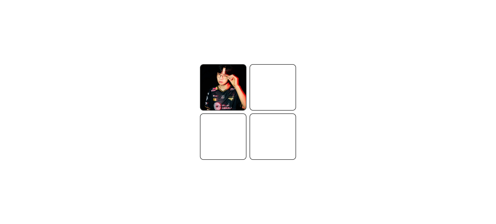

**HTML**  
이미지담을 박스 4개 = 2*2  
박스크기 160 * 160

**css**  
박스안에 이미지가 들어가니까, 태그 안에 만드네  
박스의 크기에 맞추려면은 width, height를 100%로 설정을 해주면 되네  
그리고 디테일은 background-size 는 이미지 사진, bg-position은 이미지 위치로 설정  
드래그가 가능하도록 하는 설정은 dragable = "true"라고 표시해야하네  
hovered 상태일 때의 스타일링을 만들어 줌 (박스를 점선으로 변경)

**js**  
js에서 변수만들때, 변수의 결과값이 제대로 출력하는지 콘솔 확인하는 작업 필요  
forEach문을 통해서, 박스에 드래그할 때 박스로 옮겨가는 동작을 만드네

(1) 이미지 드래그오버한 상태일때
이벤트리스너 : dragover
박스에 "hovered"라는 클래스를 추가 (add)

(2) 이미지 드래그리브 상태일 때  
이벤트리스너 : dragleave
박스에 "hovered"라는 클래스를 삭제 (remove)

(3) 이미지 드롭한 상태일때 이벤트 추가
이벤트 리스너 : drop
박스의 자식 요소를 추가 : image
박스의 "hovered" 클래스 삭제 (remove)

<h2>궁금한 점 (제미나이 & 뤼튼한테 물어보기)</h2>

<h3>1. css에서 스타일링 할때 태그명을 쓰기도하고, 클래스이름을 사용하기도 하는데 뭘 쓰는게 더좋은거임?</h3>

- 재사용성, 유지보수성, 그리고 예측 가능성 측면에서 클래스이름을 사용하는게 더 좋다!

- ID명 / 클래스명 / 태그명 순서로 우선적용이된다.

- 클래스 이름' 위주로 스타일링하고, 태그명은 정말 '기본적이고 공통적인 전역 스타일'을 잡을 때만 제한적으로 사용하는게 좋다.

<h3>2. flex-wrap은 부모 너비 넘어가면 어떻게 하는지 결정하는거 맞나?</h3>

- 맞음 (올~~)

- 자식 요소(Flex Items)들의 전체 너비가 부모(Flex Container)의 너비보다 커질 때, 이들을 한 줄에 억지로 구겨 넣을지, 아니면 다음 줄로 넘길지를 결정하는 속성

<h3>3. script 파일 속성에 defer 쓰는 이유 뭐였지? 예전에 공부하기로는 html 문서를 읽어 오기전에 script 파일이 먼저 실행되면 오류발생하니까, 이 오류 방지하기 위해서 defer쓰는 걸로 알고 있는데 맞나?</h3>

- 맞음 (올..공부한 보람이 있네. 멋지다. 이걸 기억하다니)

- defer를 쓰는 결정적인 이유

① HTML 파싱을 멈추지 않습니다 (비동기 로드)

일반적인 `<script>` 태그는 브라우저가 읽다가 스크립트를 만나면 HTML 해석을 중단(Pause)하고 파일을 다운로드한 뒤 실행합니다. 하지만 defer를 쓰면 HTML 해석과 스크립트 다운로드를 동시에 진행합니다.

② 실행 시점의 안전성

defer는 스크립트 다운로드가 완료되더라도 바로 실행하지 않고, HTML 문서 전체가 완전히 해석된 직후에 실행됩니다. 덕분에 스크립트 내에서 DOM 요소(예: 드래그 앤 드롭을 할 박스)를 찾을 때 오류가 발생하지 않습니다.

- 일반 script vs defer vs async 비교

| 방식             | HTML 파싱 | 실행 시점               | 특징                                  |
| ---------------- | --------- | ----------------------- | ------------------------------------- |
| 일반 `<script>`  | 중단됨    | 다운로드 직후 즉시 실행 | HTML 요소를 못 찾을 위험 있음         |
| `<script defer>` | 중단 없음 | HTML 파싱 완료 후       | DOM 조작 시 가장 안전함               |
| `<script async>` | 중단 없음 | 다운로드 직후 즉시 실행 | 여러 스크립트 간 실행 순서 보장 안 됨 |

<h3>4. forEach 구문을 언제 사용하는지 모르겠네</h3>

- forEach는 배열 안에 있는 모든 요소한테 뭔가 '액션'을 취하고 싶을 때

- 새로운 배열을 만들거나, 중간에 반복을 멈추는 게 아니라, 그냥 각각의 요소를 순회하면서 지정된 작업을 실행할 때 사용
- 코드  
   `배열.forEach((요소값, 인덱스, 배열전체) => {
// 실행할 코드
});`
- 새로운 배열을 만들때는 map, filter를 쓰는게 좋음.

<h3>5. e.preventDefault(); 는 이벤트 리스너 만들때 다 써줘야하는건가?</h3>

- 아니다. 기본적으로 이벤트의 기본동작을 막기위해 사용하는 코드로 남용하지 마세요.

<h3>6. position: relative는 이론상으로 position: absolute 있으면 쓰는거 아니었나. 기준점 잡는 용으로? 근데 여기서 position:absolute가 없는데 왜 쓰였는지 모르겠음</h3>

- position: absolute가 없는데 position: relative가 쓰였다면, 아래의 경우가 가능성이 높다고 하네

  - 해당 요소를 자기 원래 위치에서 조금 움직여 시각적인 정렬을 맞추거나
  - 어떤 애니메이션 효과(특히 호버 같은 것)를 주기 위해서
  - (아주 드물게) z-index를 사용하기 위한 준비 작업

<h3>7. img 태그를 굳이 안쓰고 태그의 css 스타일링에서 background-image로 넣는 이유가 뭐임? 굳이 이렇게 쓰는 이유를 모르겠음</h3>

- 이미지가 정보성이면, img 태그 / 꾸미기용이면 background-image를 사용하면 된다. 개발자가 어떤 의도로 이미지를 넣느냐에 따라서 달라진다고 보면 됨.

| 구분  |  태그                | background-image (CSS)                                |
| ----- | ------------------------- | ----------------------------------------------------- |
| 언제? | 본문의 정보성 이미지일 때 | 디자인/배경/장식용일 때                               |
| 장점  | 검색 엔진이 인식함 (SEO)  | 인쇄 시 포함됨 크기 조절/자르기/배경 처리가 매우 쉬움 |
| 단점  | 크기 조절이 까다로움      | 검색 엔진이 무시함, 인쇄 시 안 나올 수 있음           |

<h2>에러 </h2>

<h3>1. html 문서 파일에 공백이나 특수기호 들어가면 문서를 못찾는 이슈가 있다. 그래서 문서이름을 바꿨다.</h3>

`에러코드 : Cannot GET /1.%20image%20drag%20%5E&%20drop/index.html`

원인 : Cannot GET /... 에러는 브라우저가 요청한 경로에서 파일을 찾을 수 없을 때 발생하는 404 Not Found 에러의 일종입니다. 현재 올려주신 경로를 보면 폴더 이름이나 파일 이름에 포함된 특수문자와 공백이 원인일 가능성이 매우 높습니다.
