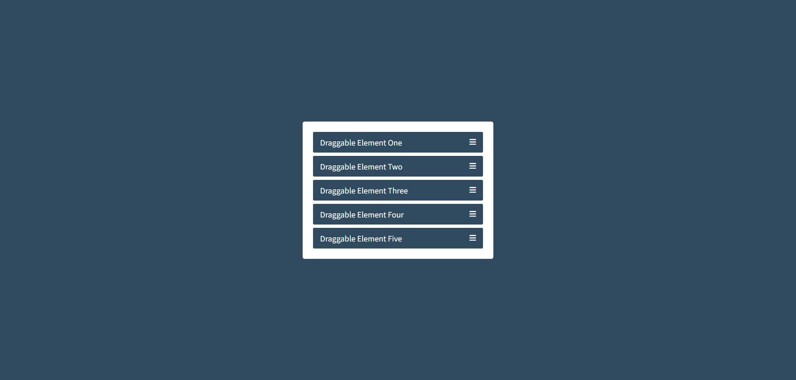

<h2>HTML</h2>

wrapper > (.item > span.text + i)\*5

<h2>CSS</h2>

wrapper max-width : 460px

<h2>JS</h2>

  <h3>sortable 라이브러리</h3>
:  웹 페이지 내의 목록을 마우스 드래그 앤 드롭으로 간편하게 재배치할 수 있게 해주는 자바스크립트 라이브러리

- https://cdnjs.com/libraries/Sortable
- https://github.com/SortableJS/Sortable?utm_source=cdnjs&utm_medium=cdnjs_link&utm_campaign=cdnjs_library

```
<ul id="items">
  <li>아이템 1</li>
  <li>아이템 2</li>
  <li>아이템 3</li>
</ul>

// 라이브러리 불러오기

<script src="https://cdn.jsdelivr.net/npm/sortablejs@1.15.0/Sortable.min.js"></script>

<script>
  // 드래그앤드롭할 목록 변수로 저장
  const el = document.getElementById('items');

  // Sortable 초기화
  new Sortable(el, {
    animation: 150,     /* 드래그 시 애니메이션 속도 (ms) */
    ghostClass: 'blue-background-class', /* 드래그 중인 아이템의 스타일 */
    onEnd: function (evt) {
      console.log('순서 변경 완료!');
      console.log('이전 인덱스:', evt.oldIndex);
      console.log('새로운 인덱스:', evt.newIndex);
    }
  });
</script>
```
