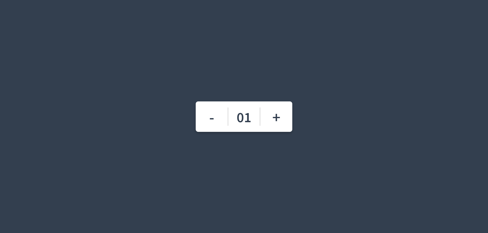

<h2>HTML</h2>
.wrapper > span.minus + span.num +  span.plus

<h2>JS</h2>
<h3>기능</h3>

1. `+` 버튼을 누르면 숫자 1씩 증가

2. `-` 버튼을 누르면 숫자 1씩 감소

3. 한자리 숫자는 앞에 "0"을 붙여서 출력

4. 음수가 되면 `- `버튼은 작동 안함

<h2>궁금한점 정리</h2>

<h3>1. 자바스크립트에서 if문 대신 쓰는 삼항연산자</h3>

: 단순한 값을 결정하거나 짦은 조건문일 때 가장 많이 사용

```
// if문을 썼을 때
let message;
if (isHappy) {
  message = "웃음";
} else {
  message = "울음";
}

// 요즘 스타일 (한 줄로 끝!)
const message = isHappy ? "웃음" : "울음";
```
